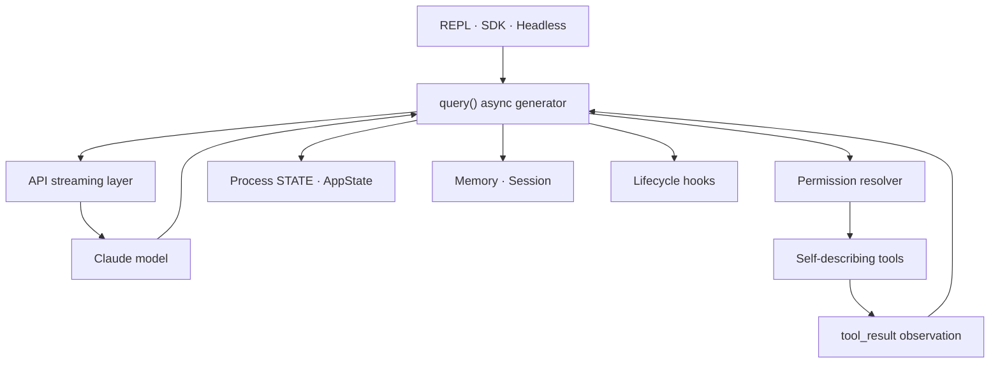

# 1장: AI 에이전트의 아키텍처

## 원저자의 관점

전통적인 CLI는 명령 하나를 수행하고 종료한다. 에이전트 CLI는 자연어 목표를
받아 도구와 순서를 스스로 선택하고, 결과를 관찰한 뒤 다시 행동한다. 원저자는
이 차이를 “모델의 추론이 제어 흐름이 되고 도구 호출이 부작용이 된다”고 표현한다.

## 여섯 핵심 추상화

1. `query()` async generator가 모든 대화의 심장이다.
2. Tool은 schema, 권한, 동시성, 실행과 렌더링을 스스로 설명한다.
3. Task는 같은 루프를 재귀적으로 실행하는 작업 단위다.
4. 상태는 process singleton과 reactive UI store로 나뉜다.
5. Memory는 세션 밖의 지식을 파일로 유지한다.
6. Hook은 수명 주기의 27개 지점에서 실행을 관찰하거나 막는다.

사용자 키 입력은 REPL, query loop, 모델 stream, tool pipeline, permission
resolver를 지나 다시 메시지로 돌아온다. CLI, SDK와 서브에이전트도 같은 루프를
사용한다.

## 전체 실행 구조



이 그림의 중심은 UI나 model이 아니라 `query()`다. UI는 message를 소비하고,
model은 다음 action을 제안하며, tool은 side effect를 수행한다. 어느 계층도
다른 계층의 실패를 성공으로 바꿀 권한은 없다.

## 실제 source 핵심 코드

```typescript
export async function* query(
  params: QueryParams,
): AsyncGenerator<StreamEvent | Message, Terminal> {
  const terminal = yield* queryLoop(params, [])
  return terminal
}
```

실제 union과 command lifecycle을 포함한 전체 signature는
[`src/query.ts` 219~235행][actual-query]에서 확인한다. architecture를 읽을 때
“모든 요청이 정말 이 함수로 들어오는가?”를 caller별로 역추적하는 것이 첫
실습이다.

## 관측과 해석

| 구분 | 확인할 수 있는 것 |
|---|---|
| SDK 관측 | assistant, tool use/result, usage, result와 error |
| source 해석 | generator transition, store 분리, hook 호출 순서 |
| 확인 불가 | source에 존재한다는 이유만으로 현재 build에서 활성화됐다는 주장 |

## 가져갈 패턴

- callback graph보다 종료 이유가 타입으로 보이는 generator loop
- 중앙 orchestrator 대신 자기 설명적인 tool
- 접근 패턴에 따른 인프라 상태와 반응형 상태의 분리
- 도구별 임시 분기 대신 named permission mode
- 하위 실행을 별도 구현하지 않고 같은 loop의 재귀로 표현

## Book SDK에서 같이 보기

Book SDK 1장 전체 스택, 3장 에이전트 루프, 20장 에이전트 생성과 함께 읽는다.

## 원문

[Chapter 1: The Architecture of an AI Agent][source]

[source]: https://github.com/alejandrobalderas/claude-code-from-source/blob/a6d5e452a8e0dd925c22c407c84611b1994562eb/book/ch01-architecture.md
[actual-query]: https://github.com/codeaashu/claude-code/blob/6a2590911df240ff5ea56aa355696cfb94d128cb/src/query.ts#L219-L235
