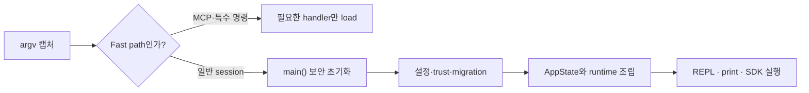

# 2장: 빠르게 시작하기 — 부트스트랩 파이프라인

## 원저자의 관점

에이전트가 생각하기 전에 프로세스가 안전하고 빠르게 존재해야 한다. Claude Code
부팅은 fast-path dispatch, module I/O, parse와 trust, setup, REPL launch의
다섯 단계 funnel이다.

## 실행 경로

- `cli.tsx`는 MCP나 특수 명령처럼 REPL 전체가 필요 없는 경로를 먼저 보낸다.
- `main.tsx`는 keychain, MDM과 네트워크 I/O를 import 작업과 겹쳐 실행한다.
- `init.ts`는 환경을 읽는 시점과 사용자가 저장소를 신뢰한 이후를 구분한다.
- `setup.ts`는 설정과 migration을 idempotent하게 적용한다.
- `replLauncher.ts`가 초기 prompt를 잃지 않고 UI와 loop를 연결한다.

## 부팅 funnel



부팅은 기능을 많이 준비하는 과정이 아니라, 필요하지 않은 범위를 가능한 빨리
제외하는 과정이다. 특히 repository를 신뢰하기 전에 project hook이나 실행
가능한 설정을 평가하면 startup 순서가 곧 권한 상승 경로가 된다.

## 실제 source 핵심 코드

```typescript
export async function main() {
  profileCheckpoint('main_function_start')
  process.env.NoDefaultCurrentDirectoryInExePath = '1'
  initializeWarningHandler()
  process.on('exit', () => {
    resetCursor()
  })
}
```

Windows PATH hijacking 방어가 command 실행보다 먼저 놓여 있다는 점을 본다.
전체 초기화 순서는 [`src/main.tsx` 585행부터][actual-main] 따라갈 수 있다.

## 직접 확인하기

1. `src/entrypoints/cli.tsx`에서 fast path를 찾는다.
2. `main_function_start` 이후 checkpoint 순서를 적는다.
3. trust 확인 전에 읽는 설정과 이후에 실행하는 hook을 구분한다.
4. startup trace에서 checkpoint가 실제로 기록됐는지 확인한다.

## 가져갈 패턴

- 느린 I/O를 모듈 평가와 병렬화한다.
- 필요 없는 범위를 가능한 일찍 제거한다.
- 신뢰 전 읽을 수 있는 정보와 신뢰 후 실행할 코드를 분리한다.
- init을 memoize해 중복 초기화를 없앤다.
- async setup 전에 초기 사용자 입력을 먼저 캡처한다.

빠른 부팅은 단순 성능 문제가 아니다. 신뢰 경계보다 먼저 훅과 설정이 실행된다면
초기화 순서 자체가 보안 문제가 된다.

## Book SDK에서 같이 보기

Book SDK 1장의 startup trace, 17b장의 prompt injection 방어, 23b장의 feature
gate 생명주기와 연결된다.

## 원문

[Chapter 2: Starting Fast — The Bootstrap Pipeline][source]

[source]: https://github.com/alejandrobalderas/claude-code-from-source/blob/a6d5e452a8e0dd925c22c407c84611b1994562eb/book/ch02-bootstrap.md
[actual-main]: https://github.com/codeaashu/claude-code/blob/6a2590911df240ff5ea56aa355696cfb94d128cb/src/main.tsx#L585-L615
