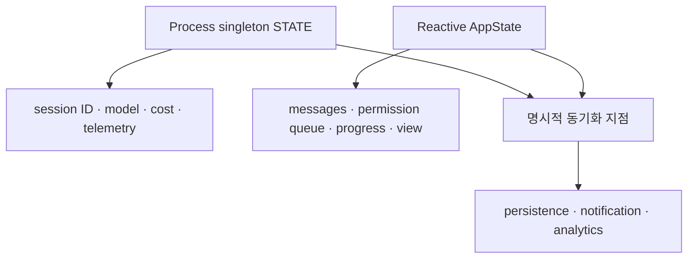

# 3장: 상태 — 2계층 아키텍처

## 원저자의 관점

모든 상태를 하나의 reactive store에 넣지 않는다. 읽고 쓰는 패턴이 다른 상태는
다른 계층에 둔다.

## 두 계층

`STATE` process singleton은 세션 ID, 모델 설정, 비용, telemetry와 startup
결과처럼 React보다 먼저 필요하고 자주 읽지만 드물게 바뀌는 필드를 가진다.
AppState는 메시지, 입력 모드, 승인 queue와 progress처럼 바뀔 때 UI가 다시
그려져야 하는 상태를 가진다.

sticky latch는 prompt cache key에 영향을 주는 feature가 한번 켜진 뒤 세션
중간에 꺼지지 않게 한다. `onChangeAppState`는 여러 mutation 경로에 side effect를
흩뿌리지 않고 상태 diff 한 곳에서 알림과 동기화를 실행한다.

## 두 수명주기



분리 기준은 “model domain”이나 “UI domain” 같은 이름이 아니다. 얼마나 자주
읽고, 얼마나 자주 바뀌며, 변경 때 누가 다시 계산되어야 하는지가 기준이다.

## 실제 source 핵심 코드

```typescript
export type AppState = DeepImmutable<{
  settings: SettingsJson
  mainLoopModel: ModelSetting
  expandedView: 'none' | 'tasks' | 'teammates'
  coordinatorTaskIndex: number
  toolPermissionContext: ToolPermissionContext
  remoteSessionUrl: string | undefined
}>
```

실제 `AppState`는 훨씬 크며 [`AppStateStore.ts` 89행부터][actual-state] 확인할
수 있다. 여기서 중요한 것은 `DeepImmutable`다. component가 내부 field를
직접 바꾸지 않고 store transition을 거치게 한다.

## 상태를 읽는 질문

- 이 값은 process가 살아 있는 동안 유지되는가, session마다 바뀌는가?
- 변경될 때 UI 전체가 다시 그려져야 하는가?
- prompt cache key에 들어가 세션 중 변경이 위험한가?
- persistence 실패 시 실행 truth가 사라지는가, 진단 정보만 사라지는가?

## 가져갈 패턴

- 도메인이 아니라 접근 패턴으로 상태를 나눈다.
- cache key를 바꾸는 값에는 한번 활성화되면 유지되는 latch를 쓴다.
- side effect는 mutation 호출부가 아니라 중앙 diff에서 발생시킨다.
- `get/set/subscribe`면 충분할 때 작은 store를 직접 소유한다.
- 비정상 종료 시 잃어도 되는 진단 데이터만 process-exit에 저장한다.

두 계층에 같은 모델 정보가 존재하는 중복은 의도된 비용이다. 중앙 동기화 지점이
명확하다면 서로의 내부를 import하는 것보다 작은 중복이 낫다.

## Book SDK에서 같이 보기

Book SDK 3장의 메시지 상태, 10장의 파일 상태 보존, 24장의 세션 간 메모리와
비교한다.

## 원문

[Chapter 3: State — The Two-Tier Architecture][source]

[source]: https://github.com/alejandrobalderas/claude-code-from-source/blob/a6d5e452a8e0dd925c22c407c84611b1994562eb/book/ch03-state.md
[actual-state]: https://github.com/codeaashu/claude-code/blob/6a2590911df240ff5ea56aa355696cfb94d128cb/src/state/AppStateStore.ts#L89-L118
