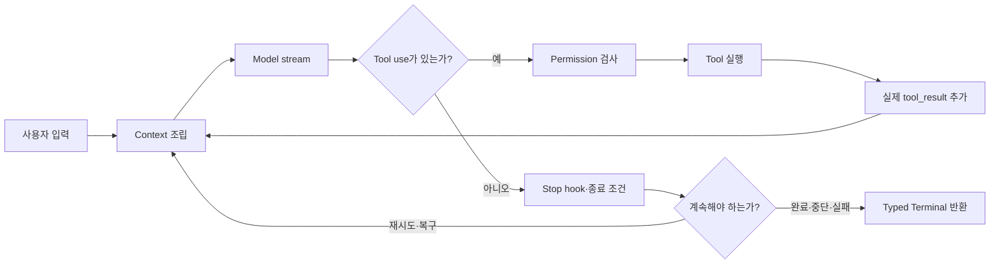
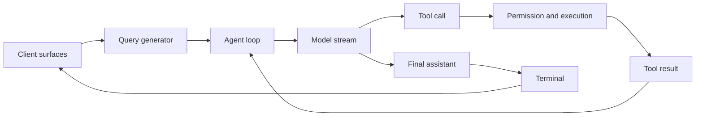
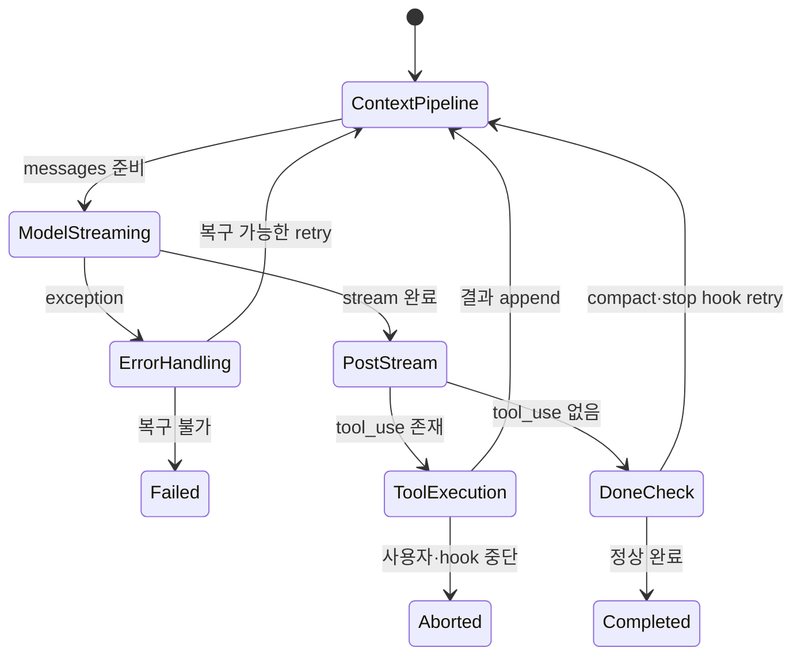
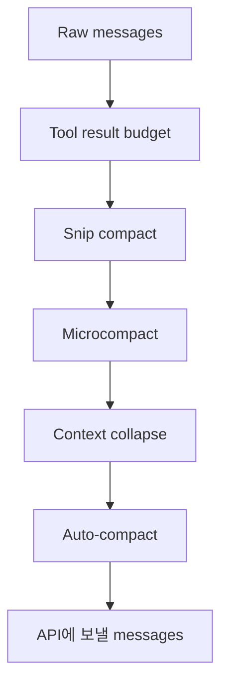
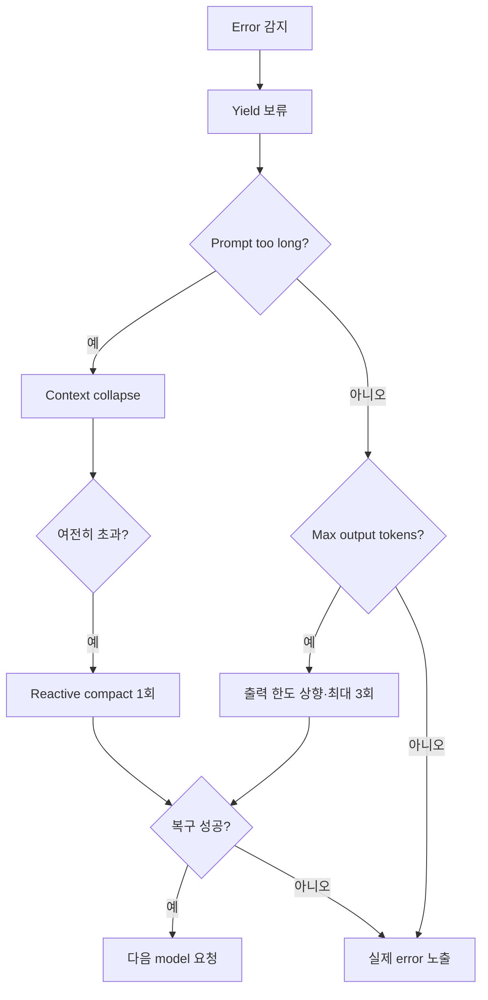

# 5장: 에이전트 루프

## 이 장의 질문

모델 API를 한 번 호출하는 것과 에이전트를 실행하는 것은 무엇이 다른가?
Claude Code가 text, tool call, tool result, retry, compaction과 중단을 하나의
실행으로 묶는 중심은 `query()`다. 이 장의 목표는 “반복 호출한다”는 요약을
넘어, 실제 source에서 loop가 어떻게 message와 terminal reason을 함께 전달하는지
읽는 것이다.

## API 호출이 에이전트가 되는 순간

API client는 요청을 보내고 stream을 돌려준다. 에이전트 loop는 그 stream에서
tool call을 찾아 실제로 실행하고, 결과를 다음 model 요청의 message로 붙인다.
모델이 더 이상 tool을 요청하지 않거나 명시적인 terminal 조건이 생길 때까지
같은 경로가 반복된다.



이 diagram은 SDK raw event가 아니다. source의 control flow를 교육용으로
재구성한 그림이다. 실제 SDK에서는 assistant message, tool use/result,
result와 error처럼 더 낮은 수준의 event를 관측한다.

## 실제 source: message를 yield하고 종료 이유를 return한다

다음은 snapshot의 `query()` 핵심이다. 바깥 generator는 내부 loop의 모든
message를 `yield*`로 전달하면서 마지막 `Terminal`도 그대로 받는다.

```typescript
export async function* query(
  params: QueryParams,
): AsyncGenerator<StreamEvent | Message, Terminal> {
  const consumedCommandUuids: string[] = []
  const terminal = yield* queryLoop(params, consumedCommandUuids)
  for (const uuid of consumedCommandUuids) {
    notifyCommandLifecycle(uuid, 'completed')
  }
  return terminal
}
```

실제 타입에는 `RequestStartEvent`, `TombstoneMessage`,
`ToolUseSummaryMessage`도 포함된다. 여기서는 control flow를 읽는 데 필요한
부분만 남겼다. 전체 코드는 [`src/query.ts` 219~235행][actual-query]에서 확인한다.

이 signature가 중요한 이유는 두 가지다.

1. 호출자는 stream 중간의 message를 소비할 수 있다.
2. loop가 끝났을 때 “끝났다”가 아니라 어떤 terminal reason으로 끝났는지 받는다.

Event emitter라면 producer가 consumer 속도와 관계없이 event를 밀어낸다.
Async generator는 consumer가 다음 값을 요청할 때 진행하므로 자연스러운
backpressure를 제공한다. SDK consumer가 tool progress를 처리하는 동안 loop도
그 경계를 존중할 수 있다.

## 두 겹의 진입점

바깥 `query()`는 command lifecycle을 마무리한다. 실제 반복은 `queryLoop()`가
담당한다. loop가 정상 return했을 때만 소비한 command를 `completed`로 표시한다.
예외가 발생하거나 consumer가 generator를 `.return()`으로 닫으면 완료 알림
구간에 도달하지 않는다.



## Loop state를 완전히 다시 만든다

source는 반복 사이에 다음 상태를 들고 간다.

```typescript
type State = {
  messages: Message[]
  toolUseContext: ToolUseContext
  autoCompactTracking: AutoCompactTrackingState | undefined
  maxOutputTokensRecoveryCount: number
  hasAttemptedReactiveCompact: boolean
  pendingToolUseSummary: Promise<ToolUseSummaryMessage | null> | undefined
  stopHookActive: boolean | undefined
  turnCount: number
  transition: Continue | undefined
}
```

전체 정의는 [`src/query.ts` 204~217행][actual-state]에 있다. 각 `continue`
지점은 일부 field만 몰래 수정하지 않고 다음 `State`를 완성해 대입한다.
`transition`에는 왜 다음 iteration으로 가는지가 남는다.

이 방식은 state machine library를 추가했다는 뜻이 아니다. 하나의 명시적 loop
안에서 transition reason을 typed data로 남기는 방식이다. 다음 turn, fallback,
reactive compact, stop hook retry가 모두 같은 `continue`로 보이더라도
`transition.reason`으로 구분할 수 있다.

## 한 iteration의 실제 순서



### 1. Context pipeline

이전 message를 그대로 보내지 않는다. tool result budget을 적용하고, 오래된
정보를 줄이며, 현재 session에 필요한 attachment와 memory를 결합한다.

### 2. Model streaming

model과 tool schema를 선택하고 stream을 읽는다. 완성된 `tool_use`가 도착하면
설정에 따라 전체 assistant 응답이 끝나기 전에 안전한 tool을 시작할 수도 있다.

### 3. Post-stream 판단

tool call이 있으면 실행 결과를 message에 붙이고 다음 iteration으로 간다.
없으면 API error, stop hook, max-turn, abort와 정상 완료를 구분한다.

## Context 압축은 한 번의 요약이 아니다

원저자는 압축을 가벼운 손실부터 무거운 손실 순으로 설명한다.



| 단계 | 하는 일 | 잃을 수 있는 것 |
|---|---|---|
| Tool result budget | 개별 결과 크기를 제한한다 | 긴 stdout·파일 내용 일부 |
| Snip | 오래된 message를 물리적으로 제거한다 | 과거의 세부 문맥 |
| Microcompact | 불필요한 tool result를 ID 단위로 제거한다 | 중간 관찰 결과 |
| Context collapse | 일정 구간을 summary로 교체한다 | 원문 표현과 세부 순서 |
| Auto-compact | 전체 대화를 별도 conversation으로 요약한다 | 가장 큰 정보 손실 |

그러므로 prompt에 “compact하라”고 썼다는 사실은 compaction을 관측했다는
증거가 아니다. 실제 SDK event, usage 변화, compact boundary와 저장된
normalized event를 확인해야 한다.

## 복구 가능한 오류를 왜 즉시 내보내지 않는가

일부 SDK consumer는 `error` field가 있는 assistant message를 받으면 session을
종료한다. prompt-too-long을 먼저 내보낸 뒤 reactive compact에 성공해도
consumer는 이미 연결을 끊었을 수 있다.

그래서 loop는 복구 가능한 intermediate error를 내부 assistant message에는
남기되 yield stream에서는 잠시 보류한다. 모든 복구 경로가 실패했을 때만 최종
error로 노출한다.



실제 source에는 `MAX_OUTPUT_TOKENS_RECOVERY_LIMIT = 3`과
`hasAttemptedReactiveCompact`가 있다. 자동 복구에는 반드시 상한이 있어야
한다. 그렇지 않으면 context를 줄이지 못한 session이 API 호출을 무한 반복할
수 있다.

## SDK에서 관측되는 것과 source에서만 보이는 것

| 항목 | Claude Agent SDK에서 관측 | source를 읽어야 알 수 있음 |
|---|---|---|
| assistant text | assistant message로 관측 | 내부 generator 분기 |
| tool call/result | tool use/result block으로 관측 | streaming admission과 batch 구성 |
| token usage | result usage에서 관측 | threshold와 recovery counter |
| error | 최종 노출 error는 관측 | 보류된 intermediate error와 retry ladder |
| compaction | boundary·usage가 있을 때 일부 관측 | snip/microcompact/collapse의 내부 우선순위 |
| 종료 | result subtype과 error로 관측 | `Terminal` discriminated union 전체 |

강의에서는 오른쪽 열을 raw SDK evidence인 것처럼 표현하면 안 된다. source
설명과 관측 evidence가 만나는 지점을 따로 표시해야 한다.

## 직접 따라가는 source 실습

1. [`query()` 진입점][actual-query]에서 `yield* queryLoop`를 찾는다.
2. 같은 파일에서 `transition:`을 검색해 모든 continue reason을 적는다.
3. `runTools(`와 `StreamingToolExecutor`를 검색해 batch 경로와 streaming
   경로가 만나는 위치를 찾는다.
4. `isWithheldMaxOutputTokens`를 찾아 어떤 message만 보류하는지 확인한다.
5. Education Shell의 실제 Claude SDK trace에서 대응 가능한 assistant,
   tool use/result, result event만 표시한다.

## 확인 질문

- Generator가 event emitter보다 agent loop에 유리한 이유는 무엇인가?
- `Terminal`과 assistant final text는 왜 같은 것이 아닌가?
- Intermediate error를 숨기는 것과 실행 진실을 조작하는 것은 어떻게 다른가?
- Auto-compact 실패 횟수에 상한이 없으면 어떤 비용 문제가 생기는가?
- source의 `transition.reason`을 SDK raw event에서 직접 볼 수 있는가?

## 핵심 정리

- 에이전트는 model 호출이 아니라 observation을 다시 model에 돌려주는 loop다.
- `query()`는 stream message를 yield하고 종료 이유를 typed value로 return한다.
- 각 iteration은 context, model stream, tool 실행, post-stream 판단으로 구성된다.
- 압축은 손실 크기가 다른 여러 계층이며 실제 event로 관측해야 한다.
- 복구 가능한 error는 consumer를 성급히 종료시키지 않도록 보류하지만, 최종
  실패는 원래 error로 노출한다.
- 모든 retry, compaction과 background action에는 circuit breaker가 필요하다.

## 원문과 실제 source

- [원저자 Chapter 5: The Agent Loop][source]
- [실제 `query()` source][actual-query]
- [실제 loop `State` source][actual-state]
- [`Terminal`과 `Continue` 타입][transitions]
- [`StreamingToolExecutor`][streaming-executor]

[source]: https://github.com/alejandrobalderas/claude-code-from-source/blob/a6d5e452a8e0dd925c22c407c84611b1994562eb/book/ch05-agent-loop.md
[actual-query]: https://github.com/codeaashu/claude-code/blob/6a2590911df240ff5ea56aa355696cfb94d128cb/src/query.ts#L219-L235
[actual-state]: https://github.com/codeaashu/claude-code/blob/6a2590911df240ff5ea56aa355696cfb94d128cb/src/query.ts#L204-L217
[transitions]: https://github.com/codeaashu/claude-code/blob/6a2590911df240ff5ea56aa355696cfb94d128cb/src/query/transitions.ts
[streaming-executor]: https://github.com/codeaashu/claude-code/blob/6a2590911df240ff5ea56aa355696cfb94d128cb/src/services/tools/StreamingToolExecutor.ts
