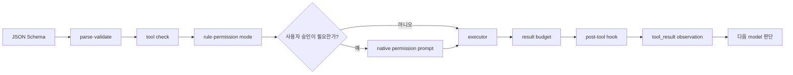

# 6장: 도구 — 정의에서 실행까지

## 원저자의 관점

Tool은 모델이 세상에 행동하는 신경계다. 이름과 함수만 가진 callback이 아니라
입력 schema, 권한, 동시성, 실행, 결과와 UI를 함께 소유한다.

## 14단계 파이프라인

입력을 parse·validate한 뒤 context와 abort signal을 준비한다. tool별 검사,
rule, permission mode와 사용자 승인을 통과하면 실행한다. 결과를 예산에 맞게
정리하고 hook과 telemetry를 거쳐 message history로 돌려준다.

`isConcurrencySafe(input)`과 `isReadOnly(input)`은 tool type이 아니라 실제
입력을 받는다. 같은 Bash 도구도 조회 명령과 파일 변경 명령의 의미가 다르기
때문이다.

## Model에서 observation까지



화면이 읽기 좋게 result를 요약할 수는 있지만, 마지막 `O`에서 model이 받는
observation은 executor가 반환한 실제 결과여야 한다.

## 실제 source: 공통 기본값

```typescript
export function buildTool<D extends AnyToolDef>(def: D): BuiltTool<D> {
  return {
    ...TOOL_DEFAULTS,
    userFacingName: () => def.name,
    ...def,
  } as BuiltTool<D>
}
```

[`buildTool()` source][actual-build-tool]는 tool마다 반복되던 기본 method를
한곳에서 채운다. `isConcurrencySafe`와 `isReadOnly` 기본값이 `false`인 것은
새 tool을 근거 없이 병렬·읽기 전용으로 분류하지 않기 위한 fail-closed 선택이다.

## Source 추적 실습

1. `FileReadTool`과 `FileEditTool`의 `buildTool()` 입력을 비교한다.
2. `isConcurrencySafe(input)`이 argument를 보는 tool을 찾는다.
3. `checkPermissions` 이후 실제 `call()`로 가는 순서를 추적한다.
4. tool use ID가 result message에 보존되는지 SDK raw event에서 확인한다.

## 가져갈 패턴

- 새 도구의 기본값은 fail-closed다.
- 안전성은 도구 이름이 아니라 parsed input으로 평가한다.
- tool 검사, rule, mode, interactive prompt와 classifier를 계층화한다.
- 입력뿐 아니라 개별·누적 tool result에도 token budget을 둔다.
- minified build에서도 안정적인 오류 분류값만 telemetry에 보낸다.

## Book SDK에서 같이 보기

Book SDK 2장 tool contract, 4장 실행 orchestration, 8장 tool prompt, 16장
permission과 함께 읽는다.

## 원문

[Chapter 6: Tools — From Definition to Execution][source]

[source]: https://github.com/alejandrobalderas/claude-code-from-source/blob/a6d5e452a8e0dd925c22c407c84611b1994562eb/book/ch06-tools.md
[actual-build-tool]: https://github.com/codeaashu/claude-code/blob/6a2590911df240ff5ea56aa355696cfb94d128cb/src/Tool.ts#L704-L791
