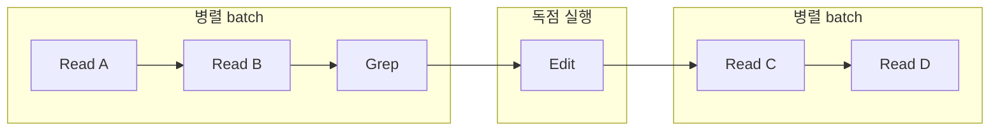
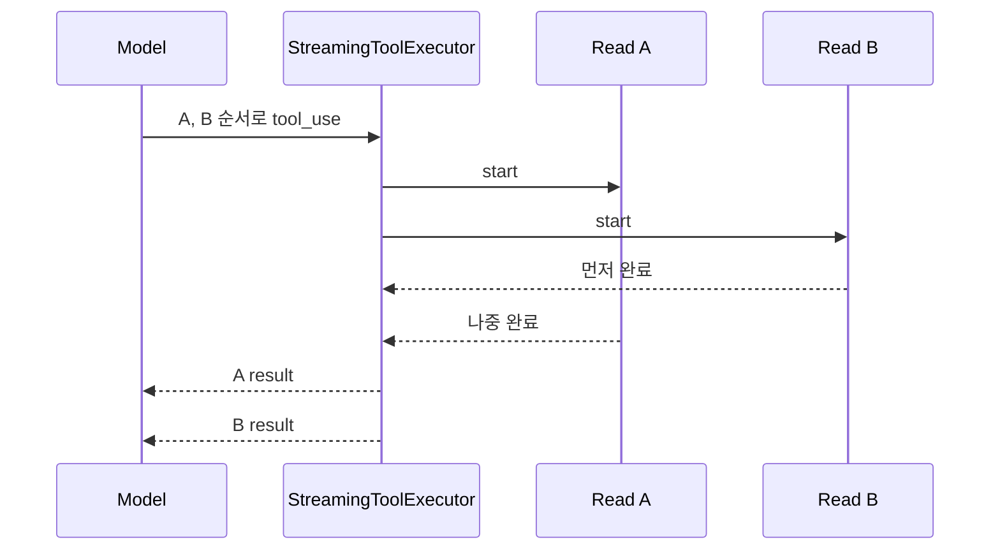

# 7장: 동시 도구 실행

## 원저자의 관점

여러 tool call이 있다고 모두 `Promise.all`로 실행하거나 모두 직렬화하지 않는다.
입력의 의미에 따라 안전한 연속 구간을 batch로 묶고, 쓰기와 context modifier는
독점 구간으로 유지한다.

## StreamingToolExecutor

모델이 전체 응답을 끝내기 전에 완성된 read-only tool call을 시작한다. 새
call이 stream으로 들어올 때 admission rule을 평가하고, 안전한 작업은 병렬로
진행한다. 완료 시점이 달라도 결과는 모델이 요청한 원래 순서대로 전달한다.

한 concurrent sibling에서 치명적 오류가 나면 abort contract에 따라 다른
subprocess를 중단한다. speculative path를 사용할 수 없게 되면 `discard()`로
정상 non-streaming 실행에 되돌아간다.

## 연속 구간으로 생각하기



병렬 안전한 call 사이에 쓰기 call이 하나 들어오면 전체 목록을 병렬화하지
않는다. 순서를 유지한 채 안전한 연속 구간만 batch로 만든다.

## 실제 source: sibling abort 경계

```typescript
export class StreamingToolExecutor {
  private tools: TrackedTool[] = []
  private hasErrored = false
  private siblingAbortController: AbortController
  private discarded = false
}
```

실제 constructor와 `discard()`는
[`StreamingToolExecutor.ts` 40~69행][actual-streaming]에 있다. sibling
controller는 Bash 오류 때 함께 실행 중인 subprocess를 중단하지만 parent
turn 전체를 abort하지 않는다. 서로 다른 중단 범위를 같은 signal로 합치지
않은 것이 핵심이다.

## 완료 순서와 제출 순서



병렬 실행은 wall-clock 완료 순서를 바꾸지만 model이 요청한 논리 순서를 바꾸지
않는다. 이 보존이 없으면 다음 reasoning에서 tool call과 observation이 어긋난다.

## 가져갈 패턴

- operation type이 아니라 실제 argument로 병렬 안전성을 분류한다.
- 느린 producer가 뒤 항목을 만드는 동안 앞의 독립 작업을 시작한다.
- 완료 순서보다 소비자가 기대하는 제출 순서를 보존한다.
- speculation에는 명확한 폐기와 정상 경로 복귀가 필요하다.

## Book SDK에서 같이 보기

Book SDK 4장의 동시성·streaming·interrupt와 27장의 프로덕션 실행 패턴에
직접 대응한다.

## 원문

[Chapter 7: Concurrent Tool Execution][source]

[source]: https://github.com/alejandrobalderas/claude-code-from-source/blob/a6d5e452a8e0dd925c22c407c84611b1994562eb/book/ch07-concurrency.md
[actual-streaming]: https://github.com/codeaashu/claude-code/blob/6a2590911df240ff5ea56aa355696cfb94d128cb/src/services/tools/StreamingToolExecutor.ts#L40-L88
