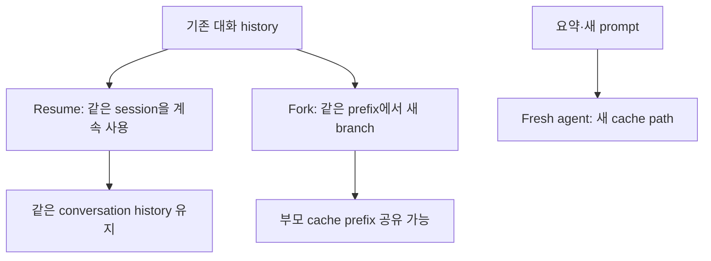

# 9장: Fork 에이전트와 프롬프트 캐시

## 원저자의 관점

fork agent는 부모가 하던 일을 요약문만 받아 새로 시작하는 자식이 아니다.
부모의 대화 prefix, system prompt, tool definition과 file state를 최대한
동일하게 유지한 채 새 실행 가지를 만든다. 이 설계의 핵심 이익은 편리함보다
프롬프트 캐시 공유에 있다.

긴 대화를 fresh agent에게 다시 제공하면 같은 token을 처음부터 처리해야 한다.
반면 byte-identical한 prefix를 유지한 fork는 부모가 이미 만든 cache를 재사용할
수 있다. 코드 검토, 기억 추출, 검증처럼 부모 context가 꼭 필요한 짧은 작업도
경제적으로 분리할 수 있는 이유다.

## 캐시가 요구하는 엄격함

프롬프트 캐시는 의미가 비슷하다고 재사용되지 않는다. byte sequence와 순서가
안정적이어야 한다. 따라서 fork child가 실제로 사용하지 못하는 tool이라도
부모와 같은 tool definition을 유지하고 실행 시 permission에서 막는 편이
cache 관점에서는 더 나을 수 있다.

동적 agent 목록이나 MCP 상태를 tool description 중간에 삽입하면 이후 prefix를
모두 바꾸게 된다. 원저자는 안정적인 system/tool 영역과 변동성이 큰 attachment를
분리하는 방식을 강조한다.

## Fork의 경계

fork는 부모 상태를 복사하지만 부모와 같은 agent는 아니다.

- 자식은 별도 agent ID와 abort lifecycle을 가진다.
- 부모의 incomplete tool call은 정리한 뒤 넘긴다.
- file cache는 복제하지만 이후 eviction과 접근 순서는 독립적이다.
- 재귀 fork는 query source와 대화 표식을 함께 검사해 막는다.
- 자식 결과가 유효해도 부모가 이를 채택하고 후속 행동을 결정해야 한다.

이 구분이 없으면 fork를 session reuse와 혼동하기 쉽다. session reuse는 같은
대화를 이어가는 것이고, fork는 같은 과거에서 출발하는 새 실행 가지다.

## Fresh, resume와 fork



세 경로는 session ID와 cache 의미가 다르다. permission 승인 후 같은 stream이
이어지는 것은 resume나 fork가 아니라 현재 turn의 계속 실행이다.

## 실제 source: cache-safe parameter

```typescript
export type CacheSafeParams = {
  systemPrompt: SystemPrompt
  userContext: { [k: string]: string }
  systemContext: { [k: string]: string }
  toolUseContext: ToolUseContext
  forkContextMessages: Message[]
}
```

[`forkedAgent.ts`][actual-fork]는 system prompt, tools, model, message prefix와
thinking config가 cache key에 영향을 준다고 주석으로 명시한다. field가 의미상
비슷한지만 보는 것이 아니라 실제 직렬화 prefix가 같아야 한다.

## 증거로 확인하기

1. fork 전후 `cache_read_input_tokens`를 비교한다.
2. model이나 tool schema가 달라진 fork를 별도로 실행한다.
3. cache hit 차이를 usage에서 확인한다.
4. session ID가 같다는 사실만으로 fork나 cache hit을 주장하지 않는다.

## 가져갈 패턴

- 캐시 공유는 prompt 내용뿐 아니라 prompt 조립 순서의 계약이다.
- 안정적 정보와 변동 정보의 위치를 분리한다.
- fork는 새 session 생성의 별명이 아니라 명시적인 branch다.
- cache 절약을 이유로 권한 경계를 약화하지 않는다.
- 내부 구현이 캐시를 실제로 재사용했는지는 usage evidence로 확인한다.

## Book SDK에서 같이 보기

Book SDK의 prompt caching, session, compaction, subagent 장과 함께 읽는다.
SDK에서 관측된 `cache_read_input_tokens`나 session/event 기록이 있을 때만 실제
cache 재사용을 말할 수 있다. “부모와 비슷한 prompt였다”는 설명만으로 cache
hit을 증명할 수는 없다.

## 원문

[Chapter 9: Fork Agents and Prompt Cache Sharing][source]

[source]: https://github.com/alejandrobalderas/claude-code-from-source/blob/a6d5e452a8e0dd925c22c407c84611b1994562eb/book/ch09-fork-agents.md
[actual-fork]: https://github.com/codeaashu/claude-code/blob/6a2590911df240ff5ea56aa355696cfb94d128cb/src/utils/forkedAgent.ts#L43-L72
