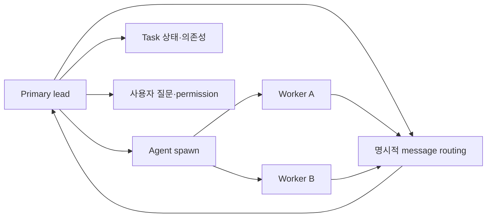

# 10장: Task, 조정과 Swarm

## 원저자의 관점

여러 agent를 spawn하는 것과 여러 agent가 하나의 작업을 조정하는 것은 다른
문제다. 조정에는 task 상태, 의존성, 메시지 전달, 결과 수집과 실패 정리가
필요하다. 원저자는 이 계층을 “더 똑똑한 모델”로 감추지 않고 명시적인 실행
기록과 routing으로 설명한다.

Task는 보통 queued, running, completed, failed, cancelled 같은 상태를 가진다.
이 상태는 agent의 지능을 나타내는 것이 아니라 누가 어떤 일을 소유하고 있는지
추적하는 운영 정보다. task dependency가 있다면 선행 작업의 terminal 상태를
확인한 뒤 후속 작업을 시작한다.

## 메시지는 자동 공유되지 않는다

team member가 생성됐다고 모든 대화가 lead에게 자동으로 보이지 않는다. member는
명시적인 메시지 도구를 사용해 lead나 다른 member에게 결과를 전달한다. background
agent 역시 완료 사실과 결과를 부모가 다시 읽을 수 있는 경로로 알려야 한다.

이 설계는 중요한 제한을 만든다.

- 자식의 일반 텍스트를 사용자 대화에 그대로 섞지 않는다.
- 사용자 질문과 permission 처리는 primary session이 소유한다.
- worker는 관찰 결과와 실패 이유를 parent에게 보낸다.
- parent가 여러 worker의 결과를 비교하고 사용자에게 설명한다.

## 동적 workflow를 과장하지 않기

모델은 상황에 따라 task를 만들고 agent를 선택할 수 있다. 그러나 SDK event에는
“동적 workflow”라는 추상 개념이 완성된 그래프로 나타나지 않을 수 있다. 실제
관측 표면에는 agent tool call, task metadata, tool result, message와 같은
더 낮은 수준의 사건만 남는다.

따라서 시각화나 교육 자료가 추상 workflow를 보여 준다면 그것은 관측 event를
근거로 재구성한 해석임을 밝혀야 한다. 존재하지 않는 노드를 raw evidence인
것처럼 표시하면 안 된다.

## 조정의 네 책임



Team이 있다는 사실만으로 worker text가 lead에게 전달되지는 않는다. routing
tool과 task result가 있어야 한다. 사용자 interaction은 lead가 소유하고 worker는
질문이나 차단 이유를 lead에게 보고한다.

## 실제 source: TaskCreate도 일반 Tool이다

```typescript
export const TaskCreateTool = buildTool({
  name: TASK_CREATE_TOOL_NAME,
  searchHint: 'create a task in the task list',
  userFacingName() {
    return 'TaskCreate'
  },
  isConcurrencySafe() {
    return true
  },
})
```

전체 schema와 enable gate는
[`TaskCreateTool.ts` 48행부터][actual-task]에 있다. Task는 숨은 추론 구조가
아니라 tool call과 persistence를 가진 명시적 제품 기능이다.

## SDK event를 graph로 바꿀 때

| graph 요소 | 필요한 근거 |
|---|---|
| worker node | agent/session/task metadata |
| task edge | parent ID 또는 명시적 dependency |
| message edge | SendMessage 같은 routing event |
| 완료 상태 | terminal tool result 또는 task update |
| “dynamic workflow” label | 위 사건을 해석한 projection임을 표시 |

## 가져갈 패턴

- spawn, task tracking, message routing, user interaction을 서로 다른 책임으로 둔다.
- agent 이름보다 task ID와 session ID를 우선해 결과를 연결한다.
- worker가 실패하면 성공 요약을 만들지 않고 원래 실패를 parent에 전달한다.
- coordination overhead가 작업 자체보다 커지는 경우 단일 agent를 유지한다.
- 관측된 사건과 교육용 해석을 같은 데이터라고 부르지 않는다.

## Book SDK에서 같이 보기

Book SDK의 Team, swarm, task event, workflow 시각화 장과 직접 연결된다. 교육
쉘에서는 Claude SDK session을 실행해 얻은 실제 task/tool event를 evidence로
보존하고, Mothership은 그 기록을 읽어 교육용 관계를 설명해야 한다. Mothership
자기 자신의 OpenCode task를 Claude SDK evidence로 대체해서는 안 된다.

## 원문

[Chapter 10: Tasks, Coordination, and Swarms][source]

[source]: https://github.com/alejandrobalderas/claude-code-from-source/blob/a6d5e452a8e0dd925c22c407c84611b1994562eb/book/ch10-coordination.md
[actual-task]: https://github.com/codeaashu/claude-code/blob/6a2590911df240ff5ea56aa355696cfb94d128cb/src/tools/TaskCreateTool/TaskCreateTool.ts#L48-L75
