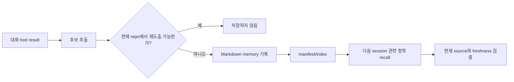

# 11장: Memory — 대화를 넘어 학습하기

## 원저자의 관점

Claude Code의 장기 기억은 거대한 비공개 데이터베이스보다 사용자가 열어 볼 수
있는 Markdown 파일을 중심으로 구성된다. 파일 저장은 고급 query 능력이 약한
대신, 무엇을 기억하는지 사용자가 직접 읽고 고칠 수 있다는 신뢰상의 이점이 있다.

원저자는 기억을 대략 사용자 선호, 피드백, 프로젝트 사실, 외부 참고 정보로
분류한다. 저장 판단에서 중요한 질문은 “현재 repository를 다시 읽으면 쉽게
도출할 수 있는가?”다. 다시 얻을 수 있는 사실을 계속 기억으로 복제하면 오래된
정보와 중복이 늘어난다.

## 저장보다 검색이 어렵다

파일에 기록하는 것만으로는 context가 되지 않는다. 현재 요청과 관련된 기억을
골라야 하고, 오래되었거나 모순되는 항목을 구분해야 한다. 원저자가 설명하는
구조는 manifest와 별도 model query를 이용해 관련 기억을 고르는 방식이다.

이때 model이 선택했다는 이유만으로 사실성이 보장되지는 않는다. source path,
작성 시각, project 범위와 현재 파일 상태를 함께 제시해야 한다. 기억은 evidence의
대체물이 아니라 다음 관찰을 안내하는 context다.

## 수명주기

1. 대화나 tool 결과에서 장기 가치가 있는 후보를 찾는다.
2. derivability와 중복 여부를 확인한다.
3. 사람이 읽을 수 있는 파일에 기록한다.
4. 다음 session에서 요청과 관련된 기억만 recall한다.
5. 오래되거나 모순된 기억을 정리한다.

background extraction이나 consolidation은 이 과정을 자동화할 수 있지만,
사용자가 확인할 수 없는 hidden memory를 진실처럼 주입해서는 안 된다.

## Memory 수명주기



기억 추출 model이 저장했다는 사실은 기억 내용이 참이라는 보장이 아니다.
source path, 작성 시각, project scope와 현재 repository를 다시 확인해야 한다.

## 실제 source: fork로 memory를 추출한다

```typescript
await runForkedAgent({
  promptMessages: [createUserMessage({ content: userPrompt })],
  cacheSafeParams: createCacheSafeParams(context),
  canUseTool: createMemoryFileCanUseTool(memoryPath),
  querySource: 'session_memory',
  forkLabel: 'session_memory',
})
```

[`sessionMemory.ts` 300~329행][actual-memory]에서 setup context와 memory file
전용 permission을 확인한다. background fork가 부모 mutable state를 직접
공유하지 않도록 격리하는 이유도 함께 읽는다.

## Memory와 evidence 구분

| 자료 | 역할 |
|---|---|
| Memory Markdown | 다음 session 판단을 돕는 편집 가능한 지식 |
| Session transcript | 실제 대화와 tool call 원전 |
| OTel/Opik trace | 실행 시간·관계·평가를 조회하는 관측 표면 |
| Skill | 반복 운영 절차 |

## 가져갈 패턴

- 저장 형식보다 provenance와 수정 가능성을 먼저 설계한다.
- 현재 repository에서 재도출 가능한 사실은 무조건 기억하지 않는다.
- recall 결과에는 source와 freshness를 함께 둔다.
- memory와 session transcript, raw event, evaluation을 서로 바꾸어 부르지 않는다.
- 자동 기억은 사람이 검사하고 삭제할 수 있어야 한다.

## Book SDK에서 같이 보기

Book SDK의 session persistence, project instruction, context, compaction 장과 함께
읽는다. Education Shell의 raw JSON이나 OTel trace는 실행 증거이며 memory가
아니다. Mothership이 강좌 운영 중 얻은 교훈을 skill이나 문서로 남길 때에도
실행 원전의 링크를 유지해야 한다.

## 원문

[Chapter 11: Memory — Learning Beyond the Conversation][source]

[source]: https://github.com/alejandrobalderas/claude-code-from-source/blob/a6d5e452a8e0dd925c22c407c84611b1994562eb/book/ch11-memory.md
[actual-memory]: https://github.com/codeaashu/claude-code/blob/6a2590911df240ff5ea56aa355696cfb94d128cb/src/services/SessionMemory/sessionMemory.ts#L300-L329
