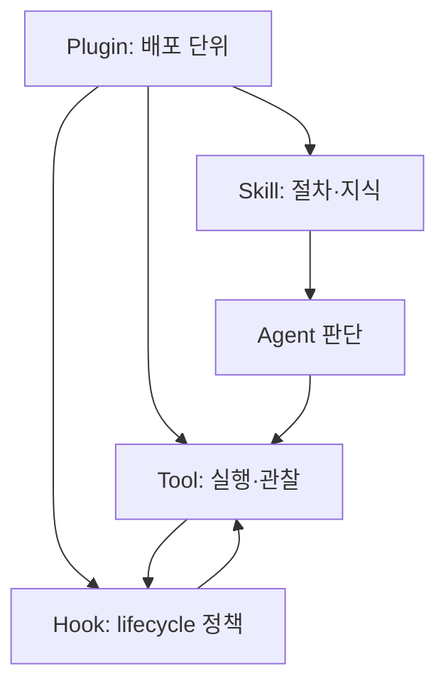

# 12장: 확장 — Skill과 Hook

## 원저자의 관점

Skill과 hook은 모두 Claude Code를 확장하지만 책임이 다르다. Skill은 모델이
특정 작업을 수행하는 방법과 사용할 resource를 제공한다. Hook은 lifecycle
경계에서 외부 process를 실행해 검사, 보완, 차단 같은 결정적 동작을 수행한다.

Skill은 발견 단계와 실제 본문 로딩 단계를 분리한다. 모든 skill의 전체 내용을
system prompt에 넣는 대신 짧은 이름과 설명으로 선택 가능성을 제공하고, 관련
skill만 필요할 때 읽는다. 이것은 context 절약뿐 아니라 서로 관계없는 지침이
모델 판단을 오염시키는 것을 줄인다.

## Hook의 process 경계

Hook은 host process 안에서 실행되는 무제한 plugin이 아니다. stdin으로 context를
받고 stdout, stderr, exit code로 결과를 돌려주는 외부 process다. 호출 비용은
있지만 crash와 memory leak을 host에서 격리하고, 언어나 package runtime에 대한
결합도 줄인다.

repository의 hook 설정을 매 tool call마다 다시 읽으면 실행 중 악성 변경이
새 권한으로 승격될 수 있다. 원저자는 trust를 확인한 startup 시점의 설정을
snapshot으로 고정하는 보안 경계를 설명한다.

## Skill, Hook, Tool을 구분하기

- Skill: agent가 어떻게 판단하고 도구를 조합할지 안내한다.
- Tool: 실제 side effect나 관찰을 수행하고 결과를 agent에 반환한다.
- Hook: lifecycle 앞뒤에서 결정적 정책이나 외부 자동화를 실행한다.

Skill 설명만으로 파일을 수정하거나 trace를 발행할 수는 없다. 반대로 tool이
있어도 어떤 순서로 관찰하고 검증할지 모르면 안정적인 운영이 되지 않는다.

## 확장 경계



Skill은 tool call을 대신하지 않고, Hook은 model의 다음 reasoning을 대신하지
않는다. 각 경계가 실제로 어떤 input/output을 갖는지 분리해 설명해야 한다.

## 실제 source: Skill도 Tool 계약으로 들어온다

```typescript
export const SkillTool = buildTool({
  name: SKILL_TOOL_NAME,
  description: async ({ skill }) => `Execute skill: ${skill}`,
  prompt: async () => getPrompt(getProjectRoot()),
  toAutoClassifierInput: ({ skill }) => skill ?? '',
})
```

실제 validation과 output schema는
[`SkillTool.ts` 331행부터][actual-skill]에 있다. Skill 본문이 바로 system
prompt 전체에 합쳐지는 것이 아니라, 선택된 skill이 tool을 통해 확장 prompt로
들어가는 경로를 확인한다.

## 직접 확인하기

1. skill metadata와 실제 `SKILL.md` 로딩 시점을 찾는다.
2. hook snapshot이 startup 이후 암묵적으로 다시 읽히는지 확인한다.
3. MCP tool과 built-in tool이 `Tool` boundary에서 어디서 같아지는지 찾는다.
4. 실패한 hook의 exit code가 성공 result로 바뀌지 않는지 확인한다.

## 가져갈 패턴

- skill metadata는 짧고 선택 가능하게, 본문은 필요할 때만 로드한다.
- hook의 입력·출력·timeout·실패 의미를 protocol로 고정한다.
- 외부 hook 실패를 성공으로 바꾸는 fallback을 만들지 않는다.
- repository trust 이후 설정 변경은 명시적으로 재승인한다.
- tool result는 agent의 다음 판단에 그대로 돌아가야 한다.

## Book SDK에서 같이 보기

Book SDK의 Skill, Hook, permission, custom tool 장과 함께 읽는다. 이 강좌
repository의 `.agents/skills`는 Codex와 Mothership이 공유하는 운영 지식이지만,
Education Shell과 Opik을 실제로 제어하는 능력은 별도의 실제 tool contract에서
나온다.

## 원문

[Chapter 12: Extensibility — Skills and Hooks][source]

[source]: https://github.com/alejandrobalderas/claude-code-from-source/blob/a6d5e452a8e0dd925c22c407c84611b1994562eb/book/ch12-extensibility.md
[actual-skill]: https://github.com/codeaashu/claude-code/blob/6a2590911df240ff5ea56aa355696cfb94d128cb/src/tools/SkillTool/SkillTool.ts#L331-L365
