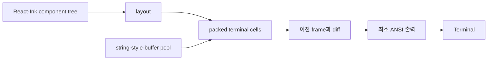

# 13장: 터미널 UI

## 원저자의 관점

Claude Code의 terminal UI는 단순히 React component를 stdout에 출력하는
구조가 아니다. model stream, tool progress와 사용자 입력이 빠르게 변하는 동안
화면 전체를 다시 그리지 않도록 별도의 rendering hot path를 갖는다.

원저자는 Ink 계층을 기반으로 하되 cell representation, string interning,
buffer pooling, diff 계산을 성능에 맞게 조정한 구조를 설명한다. React는 화면의
의미 구조와 상태 전이를 표현하고, 실제 terminal repaint는 더 낮은 수준의
packed data와 비교 연산이 담당한다.

## 렌더링 파이프라인

1. component tree가 현재 UI 상태를 만든다.
2. layout 결과가 terminal cell buffer로 변환된다.
3. 이전 frame과 현재 frame의 차이를 계산한다.
4. 바뀐 cell만 ANSI sequence로 출력한다.
5. 재사용 가능한 buffer와 문자열은 pool에서 관리한다.

이 경계 덕분에 stream chunk 하나가 올 때마다 전체 화면을 지우고 다시 쓰지
않는다. 동시에 cursor, wide character, color, resize 같은 terminal 고유
복잡성은 rendering boundary가 흡수한다.

## 교육 화면과의 차이

Education Shell은 web/Electron UI이므로 이 terminal renderer를 복제할 이유가
없다. 가져갈 것은 구현 자체가 아니라 “고빈도 raw event와 사람이 읽는 projection을
분리한다”는 원칙이다. raw event를 화면에 JSON으로 쏟는 것과 빠른 UI는 같은
문제가 아니다.

## Rendering hot path



React는 화면의 의미를 표현하지만, 고빈도 character diff는 더 낮은 rendering
계층이 담당한다. 상태 update와 실제 terminal write를 같은 비용으로 취급하지
않는다.

## 실제 source: frame 재사용

```typescript
reset(width: number, height: number, screen: Screen): void {
  this.width = width
  this.height = height
  this.screen = screen
  this.operations.length = 0
  resetScreen(screen, width, height)
  if (this.charCache.size > 16384) this.charCache.clear()
}
```

[`Output.reset()`][actual-output]은 backing storage와 character cache를 frame
사이에 재사용한다. cache가 무한히 자라지 않도록 명시적 상한도 둔다.

## UI projection 검토

- assistant delta가 올 때 전체 message tree가 다시 layout되는가?
- tool progress label이 container 크기를 바꾸는가?
- raw event와 사용자용 message가 같은 component에서 JSON으로 섞이는가?
- 실패와 permission state가 색상만으로 구분되는가?

## 가져갈 패턴

- 상태 의미와 고빈도 painting hot path를 분리한다.
- 동적 content가 layout 크기를 흔들지 않도록 frame 경계를 안정화한다.
- 전체 redraw보다 이전 frame과의 실제 차이를 계산한다.
- 최적화는 profile과 frame time 측정 뒤에 한다.
- display projection이 raw execution truth를 변경해서는 안 된다.

## Book SDK에서 같이 보기

Book SDK의 streaming, terminal interaction, event rendering 장과 함께 읽는다.
Mothership Chat은 OpenCode native event를 보존하되 사용자에게는 시간순 메시지,
tool 상태와 필요한 evidence link를 읽을 수 있는 형태로 투사한다.

## 원문

[Chapter 13: The Terminal UI][source]

[source]: https://github.com/alejandrobalderas/claude-code-from-source/blob/a6d5e452a8e0dd925c22c407c84611b1994562eb/book/ch13-terminal-ui.md
[actual-output]: https://github.com/codeaashu/claude-code/blob/6a2590911df240ff5ea56aa355696cfb94d128cb/src/ink/output.ts#L170-L202
