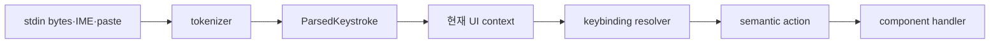

# 14장: 입력과 상호작용

## 원저자의 관점

terminal key input은 항상 한 글자나 하나의 key event로 오지 않는다. escape
sequence, modifier, IME, paste, chord와 terminal 종류에 따라 여러 byte가 하나의
의미를 만들 수 있다. 따라서 raw byte를 feature component가 직접 해석하면
동일한 단축키 로직이 곳곳에 중복된다.

원저자는 input tokenizer, keybinding resolver, context와 command handler를
분리한다. parser는 여러 terminal protocol을 정규화된 `ParsedKey`로 바꾸고,
resolver는 현재 UI context와 chord 상태에 따라 의미 있는 action을 선택한다.

## Context가 우선한다

같은 Enter나 Escape도 composer, permission dialog, autocomplete, plan 화면에서
의미가 다르다. 전역 key handler 하나에 계속 조건을 추가하는 대신 현재 interaction
context가 받을 수 있는 action을 제한한다.

vim mode 같은 입력 방식은 단순 boolean보다 mode를 명시한 discriminated union이
안전하다. 현재 mode에서 존재하지 않는 field를 type level에서 사용할 수 없게
하면 상호작용 버그가 줄어든다.

## Byte에서 action까지



feature component는 escape sequence나 modifier alias를 직접 해석하지 않는다.
parser가 platform 차이를 흡수한 뒤 `action`을 전달한다.

## 실제 source: modifier 정규화

```typescript
export function parseKeystroke(input: string): ParsedKeystroke {
  const parts = input.split('+')
  const keystroke: ParsedKeystroke = {
    key: '',
    ctrl: false,
    alt: false,
    shift: false,
    meta: false,
    super: false,
  }
}
```

실제 switch는 `ctrl/control`, `alt/opt/option` 같은 alias를 같은 field로
정규화한다. [`keybindings/parser.ts`][actual-input]에서 chord parser와 표시용
canonicalization도 함께 확인한다.

## 한글 입력을 볼 때

IME composition 중 text를 확정 입력으로 오인하지 않는지, composer state
변경이 timeline 전체 selector를 깨우지 않는지 확인한다. 입력 지연을 model
latency로 오인하지 않도록 key event, state update와 render 시간을 분리해
계측해야 한다.

## 가져갈 패턴

- raw bytes, parsed key, semantic action을 서로 다른 계층으로 둔다.
- chord는 첫 key를 즉시 실행하지 않고 짧은 상태와 timeout으로 해석한다.
- focus와 modal context가 keybinding 우선순위를 소유한다.
- paste와 IME 입력을 반복 key press로 오인하지 않는다.
- 접근성과 플랫폼 차이를 component마다 다시 구현하지 않는다.

## Book SDK에서 같이 보기

Book SDK의 permission, question, abort와 interactive session 장에서 유용하다.
Education Shell의 한글 composer나 Mothership 입력이 느리다면 모델 실행보다 먼저
controlled input의 render 범위, logger, selector와 IME composition 경로를
점검해야 한다.

## 원문

[Chapter 14: Input and Interaction][source]

[source]: https://github.com/alejandrobalderas/claude-code-from-source/blob/a6d5e452a8e0dd925c22c407c84611b1994562eb/book/ch14-input-interaction.md
[actual-input]: https://github.com/codeaashu/claude-code/blob/6a2590911df240ff5ea56aa355696cfb94d128cb/src/keybindings/parser.ts#L9-L35
