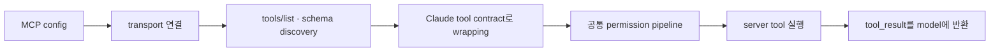

# 15장: MCP — 범용 도구 프로토콜

## 원저자의 관점

MCP의 가치는 새로운 tool call 문법을 만드는 데 있지 않다. 외부 server가
자신의 tool과 resource를 발견 가능하게 공개하고, agent client가 이를 내장
tool과 같은 실행 계약으로 다룰 수 있게 하는 데 있다.

Claude Code는 stdio, HTTP, SSE, WebSocket, SDK와 IDE/remote 계열을 포함한 여러
transport를 지원한다. transport는 연결 수명주기와 인증 방식이 다르지만,
discovery 이후 model이 보는 tool은 공통 이름, description, input schema와
result contract로 정규화된다.

## 연결에서 실행까지

1. 설정과 scope에서 MCP server 목록을 읽는다.
2. transport별 connection과 인증을 준비한다.
3. server의 tool 목록과 schema를 조회한다.
4. 충돌 없는 이름과 안정적인 description으로 wrapping한다.
5. 일반 tool pipeline에서 permission, execution과 result budget을 적용한다.

MCP tool을 별도의 “낮은 등급 도구”로 취급하지 않는 것이 중요하다. 한 번
정규화되면 built-in tool과 같은 model decision surface에 있어야 한다. 다만
server 연결 실패와 schema 오류는 원래 출처를 유지한 채 보여 줘야 한다.



## 실제 source: placeholder가 되는 공통 tool

```typescript
export const MCPTool = buildTool({
  isMcp: true,
  isOpenWorld() {
    return false
  },
  name: 'mcp',
  maxResultSizeChars: 100_000,
  async checkPermissions() {
    return { behavior: 'passthrough', message: 'MCPTool requires permission.' }
  },
})
```

[`MCPTool.ts`][actual-mcp]의 기본 객체는 실행할 실제 server tool이 아니다.
`mcpClient.ts`가 discovery 결과로 이름, description, schema와 `call()`을
덮어쓸 수 있게 만든 공통 골격이다. 여기서 중요한 점은 동적으로 발견한 tool도
`buildTool()`이 만든 동일한 permission과 result 계약에 들어온다는 것이다.

## MCP와 직접 도구

MCP가 모든 control boundary의 정답은 아니다. 같은 Electron renderer의 상태를
즉시 조작하고 관찰하는 기능은 typed IPC tool이 더 단순할 수 있다. 외부 Notion,
database, browser처럼 독립 service와 재사용 가능한 protocol 경계가 필요할 때
MCP가 적합하다.

핵심은 transport 선택이 아니라 agent가 tool result를 온전히 받고 다음 행동을
스스로 결정할 수 있는지다.

## 가져갈 패턴

- protocol transport와 model-facing tool contract를 분리한다.
- server가 제공한 failure를 fake success로 바꾸지 않는다.
- tool 이름 충돌과 description 길이를 안정적으로 정규화한다.
- OAuth/token은 trace와 model context에 노출하지 않는다.
- 내부 UI control을 이유 없이 remote protocol로 우회하지 않는다.

## Source exercise

1. [`MCPTool.ts`][actual-mcp]에서 `Overridden in mcpClient.ts` 주석을 모두 찾는다.
2. 각 override가 discovery, permission, execution, presentation 중 어느 책임인지
   분류한다.
3. server 연결 실패가 model에게 정상 `tool_result`로 전달되는지, host가 임의의
   성공 문자열로 바꾸는지 호출 경로를 따라간다.

## Book SDK에서 같이 보기

Book SDK의 MCP, custom tool, permission 장과 연결된다. Notion 운영에는 공식
Notion MCP처럼 실제 workspace object를 다루는 protocol을 사용하고, Pixel이나
Education Shell renderer 제어는 실제 renderer observation을 반환하는 direct
tool boundary를 유지하는 식으로 구분할 수 있다.

## 원문

[Chapter 15: MCP — The Universal Tool Protocol][source]

[source]: https://github.com/alejandrobalderas/claude-code-from-source/blob/a6d5e452a8e0dd925c22c407c84611b1994562eb/book/ch15-mcp.md
[actual-mcp]: https://github.com/codeaashu/claude-code/blob/6a2590911df240ff5ea56aa355696cfb94d128cb/src/tools/MCPTool/MCPTool.ts#L27-L75
