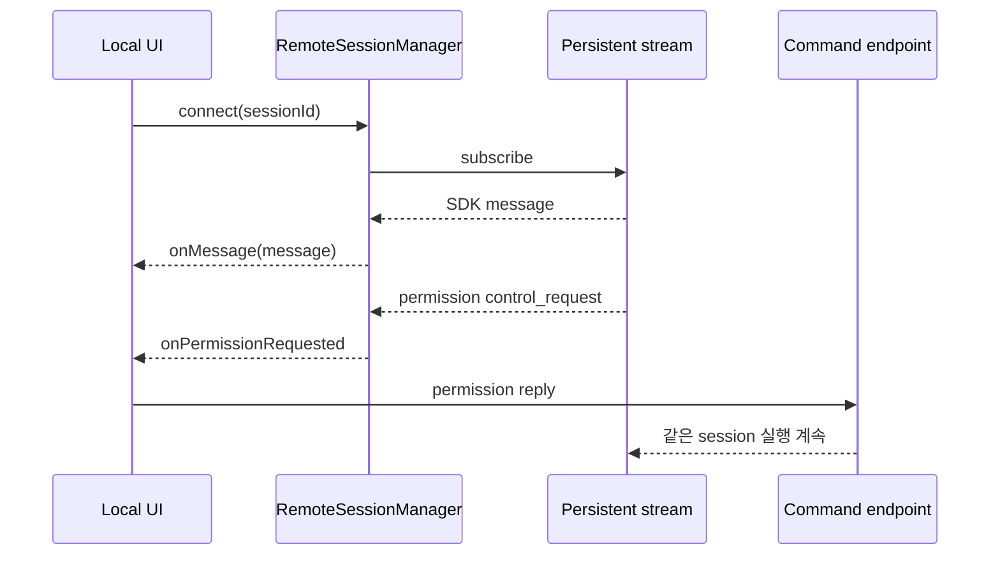

# 16장: 원격 제어와 클라우드 실행

## 원저자의 관점

원격 agent에서는 읽기와 쓰기의 traffic 성격이 다르다. server에서 client로
오는 model/event stream은 길고 지속적이며, client에서 server로 가는 permission
reply, user message, abort는 상대적으로 드문 command다. 원저자는 이를 하나의
양방향 추상화로 감추기보다 persistent read channel과 명시적 write request로
분리한다.

## 비대칭 channel

- read: 장시간 유지되는 SSE stream으로 event를 순서대로 받는다.
- write: HTTP request로 message, permission reply와 control command를 보낸다.
- reconnect: 마지막으로 처리한 event 위치와 중복 제거 범위를 유지한다.
- lifecycle: remote session ID와 local view state를 구분한다.

연결이 끊긴 뒤 같은 event가 다시 올 수 있으므로 bounded dedup이 필요하다.
그렇다고 모든 event ID를 process lifetime 동안 무한히 보존하면 memory leak이
된다. session/turn 경계와 최대 window를 명시해야 한다.



## 실제 source: remote session의 소유 상태

```typescript
export class RemoteSessionManager {
  private websocket: SessionsWebSocket | null = null
  private pendingPermissionRequests:
    Map<string, SDKControlPermissionRequest> = new Map()

  constructor(
    private readonly config: RemoteSessionConfig,
    private readonly callbacks: RemoteSessionCallbacks,
  ) {}
}
```

[`RemoteSessionManager.ts`][actual-remote]는 연결과 pending permission을 같은
remote session manager에 둔다. `control_request`는 map에 보존되고,
`control_cancel_request`가 오면 삭제한 뒤 UI callback에 취소 사실을 전달한다.
permission을 별도 대화의 prompt로 바꾸는 projection이 아니다.

## Resume의 의미

resume은 permission dialog 뒤에 별도 session을 만드는 동작이 아니다. 살아 있는
SSE에서 permission에 답한 뒤 같은 실행이 계속 흐르는 것이 정상이다. session
resume은 process 재시작이나 연결 단절 뒤 server가 보존한 같은 대화를 다시
연결할 때 의미가 있다.

## 가져갈 패턴

- stream 유지와 command 전송을 같은 수명주기로 오해하지 않는다.
- local run ID와 remote session ID를 모두 기록하되 서로 바꾸지 않는다.
- reconnect 시 중복 제거와 유실 여부를 관측 가능하게 만든다.
- permission reply는 새 turn이나 새 session을 암묵적으로 만들지 않는다.
- session이 없으면 없는 이유를 보고하고 임의의 새 session으로 성공시키지 않는다.

## 실패를 읽는 질문

- 연결 재시도 뒤 같은 control request가 재방출되면 request ID로 구분되는가?
- 취소된 permission이 UI에 남아 클릭 가능한 유령 banner가 되는가?
- local composer state와 remote session truth 중 어느 쪽이 실행 상태를 결정하는가?
- stream이 끊겼을 때 새 session을 만들어 성공처럼 보이게 하는 fallback이 있는가?

## Book SDK에서 같이 보기

Book SDK의 session resume, streaming, permission과 remote runtime 장에 대응한다.
Mothership은 embedded OpenCode server의 native SSE를 소유하고, 일반 Education
Chat provider projection과 섞지 않는다. 두 surface가 같은 project를 사용해도
session truth는 각각의 runtime ID에 있다.

## 원문

[Chapter 16: Remote Control and Cloud Execution][source]

[source]: https://github.com/alejandrobalderas/claude-code-from-source/blob/a6d5e452a8e0dd925c22c407c84611b1994562eb/book/ch16-remote.md
[actual-remote]: https://github.com/codeaashu/claude-code/blob/6a2590911df240ff5ea56aa355696cfb94d128cb/src/remote/RemoteSessionManager.ts#L88-L151
