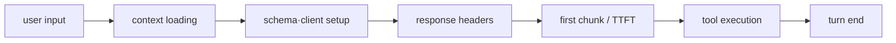

# 17장: 모든 밀리초와 토큰

## 원저자의 관점

에이전트 성능은 model latency 하나로 설명되지 않는다. startup module loading,
keychain/network I/O, prompt cache, output token reservation, file search,
stream parsing과 UI rendering이 누적된다. 원저자는 추측성 최적화보다 먼저
측정 지점을 촘촘하게 두는 방식을 강조한다.

## Context와 비용

API 요청이 허용하는 context에서 `max_output_tokens`로 예약한 영역은 input에
사용할 수 없다. 실제 p99 output보다 지나치게 큰 값을 항상 예약하면 긴 대화의
usable context를 스스로 줄인다. 보수적인 기본값을 쓰고 truncation이 실제로
발생할 때 확장하는 편이 낫다.

prompt cache 역시 비용 구조다. 안정적 system prompt와 tool definition을 앞에,
session마다 변하는 정보는 뒤에 두어 prefix를 유지한다. 동적 tool description
하나가 중간에 들어가면 이후 cache를 전부 무효화할 수 있다.

## 실행 hot path

- startup I/O는 module import와 겹쳐 실행한다.
- read-only tool의 안전한 연속 구간은 streaming 중 먼저 시작한다.
- 긴 tool input JSON은 chunk마다 partial parse하지 않고 모아 한 번 파싱한다.
- file search는 저렴한 bitmap pre-filter로 후보를 줄인다.
- terminal frame은 packed cell과 diff로 필요한 부분만 갱신한다.

이 기법들은 화려한 알고리즘보다 병목이 실제로 있는 위치에 기본기를 적용한
결과다.



## 실제 source: 추측 전에 checkpoint

```typescript
export function queryCheckpoint(name: string): void {
  if (!ENABLED) return
  const perf = getPerformance()
  perf.mark(name)
  memorySnapshots.set(name, process.memoryUsage())
}
```

[`queryProfiler.ts`][actual-profiler]는 user input부터 context loading, schema
build, request dispatch, response header, first chunk, tool execution까지 서로 다른
checkpoint를 둔다. “느리다”는 한 문장을 TTFT, tool latency, render latency로
분해할 수 있어야 최적화가 설계 오염으로 변하지 않는다.

## 가져갈 패턴

- startup, first token, tool latency, render 시간을 따로 측정한다.
- context budget과 비용을 같은 지표로 보지 않는다.
- cache hit은 prompt 구조와 실제 usage field로 검증한다.
- speculation에는 abort와 정상 경로 복귀가 있어야 한다.
- 성능 측정 없는 최적화는 architecture를 복잡하게 만들 수 있다.

## 측정 실습

1. `query_first_chunk_received - query_api_request_sent`를 provider 응답 지연으로
   분리한다.
2. `query_tool_execution_start/end`에서 느린 tool 하나를 찾는다.
3. 같은 run의 renderer timing과 비교해 model, tool, UI 중 실제 병목을 정한다.
4. cache usage field가 없으면 prompt cache hit을 관측했다고 쓰지 않는다.

## Book SDK에서 같이 보기

Book SDK의 token usage, prompt caching, streaming, concurrent tool과 production
운영 장에 직접 연결된다. Education Shell과 Opik에는 실제 provider, model,
cache read/write와 tool timing을 기록하고, 관측되지 않은 cache hit을 추론해서
평가 결과로 만들지 않는다.

## 원문

[Chapter 17: Every Millisecond, Every Token][source]

[source]: https://github.com/alejandrobalderas/claude-code-from-source/blob/a6d5e452a8e0dd925c22c407c84611b1994562eb/book/ch17-performance.md
[actual-profiler]: https://github.com/codeaashu/claude-code/blob/6a2590911df240ff5ea56aa355696cfb94d128cb/src/utils/queryProfiler.ts#L1-L76
